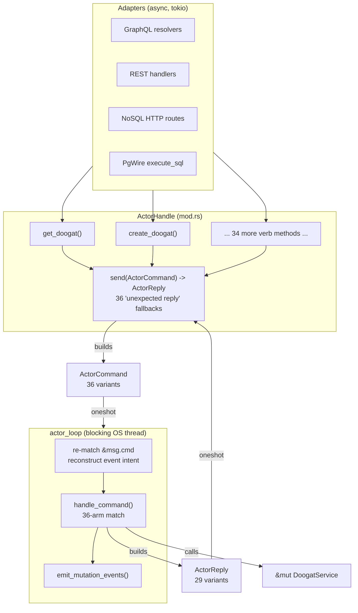

# Design Document: collapse-actor-plumbing

> Server-internal refactor of the `ddb-server` write actor (PRD 00172).
> Enabling refactor that unblocks 00175/00176/00177/00178. No public surface change.

## Overview

The `ddb-server` write actor (`ddb-server/src/actor/mod.rs`, `handlers.rs`) pays a
per-verb boilerplate tax. Adding one verb today edits **four synchronized places**:
an `ActorCommand` variant (36 struct-like variants, mod.rs:44-173), an `ActorReply`
variant (29 variants, mod.rs:176-207), an `ActorHandle` verb method (each ending in a
copy-pasted `_ => Err(DoogatError::Validation("unexpected reply".into()))` fallback —
36 identical arms), and a dispatch arm in `handlers::handle_command` (36-arm match,
handlers.rs:9). That is ~1000 LOC of pure plumbing whose only job is relaying a call to
`DoogatService` on the actor's blocking OS thread (`actor_loop`, mod.rs:497). Worse,
the loop re-derives each mutation's *event intent* by re-matching `&msg.cmd` variants
(mod.rs:512-537) before calling `emit_mutation_events`.

The target idiom already ships next door: `ReadPool::with_service` /
`with_service_mut` take `move |svc| svc.method(...)` closures at 22 read call sites
(read_pool.rs). The write actor is the last holdout that still uses twin enums.

This refactor **converges the write path on the closure idiom the read pool already
proves**: one generic `ActorHandle::call<R>` carrying a boxed
`FnOnce(&mut DoogatService) -> R` closure plus its own typed reply channel replaces
every per-verb method, `handle_command` disappears (the closure *is* the dispatch),
and the twin enums are deleted. Event emission moves from command re-matching to an
explicit `EventIntent` carried on the message. The five hand-wired schema-reload
triggers scattered across adapters collapse into **one derivation helper called from
one place** — the actor bridge.

The overriding correctness obligation is **byte-identical behavior**: every existing
server/e2e test must pass unchanged, and GraphQL/REST/NoSQL/PgWire responses must be
identical pre/post. Verification follows the 00156 method — diff the moved logic, rely
on the unchanged suites as the oracle — not output re-derivation.

---

## Architecture

### Current shape (the four-touch-point tax)



### Target shape (one closure, one dispatch)

```mermaid
graph TD
    subgraph adapters["Adapters (async, tokio)"]
        GQL[GraphQL resolvers]
        REST[REST handlers]
        NOSQL[NoSQL HTTP routes]
        PG[PgWire execute_sql]
    end

    CALL["ActorHandle::call&lt;R&gt;(event_intent, closure)<br/>ONE generic entry point"]

    MSG["ActorMsg { run: Box&lt;FnOnce(&amp;mut DoogatService)+Send&gt;,<br/>event: EventIntent }"]

    subgraph loop["actor_loop (blocking OS thread)"]
        RUN["(msg.run)(&amp;mut svc)<br/>the closure IS the dispatch"]
        EMIT["emit_mutation_events(&amp;bus, &amp;msg.event)<br/>reads EventIntent field"]
        RELOAD["schema_reload::derive(&amp;result)<br/>ONE policy helper"]
    end

    SVC["&mut DoogatService"]
    BUS[EventBus]
    RLD[SchemaReloader]

    adapters --> CALL
    CALL -->|"boxes closure + intent"| MSG
    MSG -->|oneshot&lt;R&gt;| loop
    RUN -->|"&mut svc param"| SVC
    RUN -->|"R over oneshot"| CALL
    RUN --> EMIT --> BUS
    RUN --> RELOAD --> RLD
```



`ActorCommand`, `ActorReply`, and `handle_command` are gone. The read pool's closure
API is unchanged; read and write now share one transport pattern.

### Sequence: a mutation routed through `call` (target)

```mermaid
sequenceDiagram
    participant A as Adapter (GraphQL/REST/NoSQL/PgWire)
    participant H as ActorHandle::call
    participant L as actor_loop (OS thread)
    participant S as DoogatService
    participant B as EventBus
    participant R as SchemaReloader

    A->>H: call(EventIntent::Created, |svc| svc.create(cmd))
    H->>H: alloc oneshot<R>; box closure that runs f and sends R
    H->>L: send ActorMsg { run, event }
    Note over H: awaits reply_rx
    L->>S: (msg.run)(&mut svc)  // = svc.create(cmd)
    S-->>L: R = AppOutput<ParsedDoogat>
    L->>B: emit_mutation_events(bus, &msg.event)  // from field, not re-match
    L->>R: schema_reload::derive(&result) -> trigger iff schema changed
    L-->>H: send R over oneshot
    H-->>A: R (verb's own return type)
```

---

## Components and Interfaces

### Component 1: `actor` module — closure message + generic `call`

**Location**: `ddb-server/src/actor/mod.rs`

**Purpose**: Own the closure message type, the single generic `call`, the blocking
loop, and event emission from explicit intent. `handlers.rs`'s `handle_command`
(and the whole file's dispatch role) is removed — the closure carries the dispatch.

**Interface** (target):

```rust
/// Explicit event intent carried alongside the closure for event-bearing verbs.
/// Non-mutating verbs use `EventIntent::None`. Replaces the `match &msg.cmd`
/// introspection in the current actor_loop (mod.rs:512-537).
pub enum EventIntent {
    None,
    Created,
    Updated,
    /// Delete carries id+type resolved BEFORE the delete runs (the row is gone after).
    Deleted { id: String, doogat_type: Option<String> },
    /// batch_create -> Created per returned doogat.
    CreateMany,
    /// batch_update -> Updated per returned doogat.
    BatchUpdate,
    /// upsert_singleton -> Created or Updated depending on outcome.created.
    Upsert { type_name: String },
}

/// The one message the actor understands: a boxed closure + its event intent.
/// Replaces `ActorCommand` + `ActorReply` + `ActorMsg { cmd, reply }`.
struct ActorMsg {
    run: Box<dyn FnOnce(&mut DoogatService, &EventBus) + Send>,
    event: EventIntent,
}

impl ActorHandle {
    /// Route ONE verb through the actor. Replaces all 36 per-verb methods.
    ///
    /// Allocates a oneshot, boxes a closure that runs `f` and sends `R` into the
    /// sender, ships it as the message, awaits. No command/reply variant, no
    /// "unexpected reply" arm.
    pub async fn call<R, F>(&self, event: EventIntent, f: F) -> R
    where
        F: FnOnce(&mut DoogatService) -> R + Send + 'static,
        R: Send + 'static;
}
```

**Responsibilities**:
- Serialize all writes onto the single blocking OS thread (unchanged concurrency model).
- Emit `DoogatEvent`s from `msg.event`, never by re-matching a command.
- Drive the centralized schema-reload derivation once per actor-routed mutation.
- Preserve the actor-gone / dropped-reply structured-error path (never panic).

**Removed exports**: `ActorCommand`, `ActorReply`, `handle_command`, and all 36
`ActorHandle` verb methods (`get_doogat`, `create_doogat`, ... `apply_schema`).

### Component 2: `schema_reload` derivation helper

**Location**: `ddb-server/src/reload.rs` (helper) + one call site in the actor bridge.

**Purpose**: Decide "this mutation changed the schema" from the core result in **one
place**. Retires all five hand-wired trigger sites:
`schema/mutations/operations.rs:265-267`, `:307-308`, `:578-579`,
`rest.rs:464-465`, `pgwire.rs:116-117`.

**Interface**:

```rust
/// A signal the closure returns so the actor bridge can decide reload without
/// re-inspecting SQL text per adapter. Adapters set the appropriate variant when
/// they build the closure result; SQL paths already have `requires_schema_reload`.
pub enum SchemaChange {
    /// The mutation did not touch the schema.
    None,
    /// The mutation changed the schema; the bridge fires exactly one reload.
    Changed,
}

impl SchemaReloader {
    /// The ONE policy call. Fires exactly one reload iff `change == Changed`.
    /// Called once by the actor bridge for every actor-routed mutation
    /// (GraphQL/REST/NoSQL applySchema/executeSql/executeBatch, PgWire DDL).
    pub async fn apply(&self, change: SchemaChange);
}
```

**Rationale for one call site**: PgWire routes all non-SELECT SQL (all DDL) through
`self.actor.execute_sql` (pgwire.rs:110-114). Because that call now flows through the
actor bridge, the bridge's single `apply` covers PgWire DDL. Keeping the PgWire-side
trigger (pgwire.rs:116-117) would **double-fire** — so it is retired with the rest.

### Component 3: Adapter call sites (migrated, behavior-preserving)

**Locations**: `ddb-server/src/schema/mutations/**`, `rest.rs`, `nosql_api.rs`,
`pgwire.rs`, `schema/subscriptions.rs`.

**Purpose**: Each adapter calls `ActorHandle::call` with a closure that invokes the
same `DoogatService` method it invokes today, threading the right `EventIntent`.
Response shapes are byte-identical.

- **GraphQL**: resolvers call `actor.call(intent, |svc| svc.method(...))` instead of
  `actor.method(...)`. Return types unchanged (`apply_schema` still yields
  `AppOutput<SchemaApplyReport>`).
- **REST**: handlers call `call`; retire the local reload at rest.rs:464-465.
- **NoSQL HTTP**: three read routes (nosql_api.rs:29-31: get/scan/backlinks, fronting
  four actor verbs) route through `call` with `EventIntent::None`.
- **PgWire**: `execute_sql` (pgwire.rs:110-114) moves onto `call`; the reload trigger
  (pgwire.rs:116-117) is retired (covered by the bridge).
- **Maintenance** (`sync`, `compact`, `run_maintenance`): migrate to `call`, keep
  running inline on the write loop for now (00174 moves them to a dedicated worker).

**Not touched**: `read_pool.rs` never *calls* `ActorHandle` — it only names it in a
doc comment (read_pool.rs:23-25). Only that doc comment is updated.

---

## Data Models

### `EventIntent` (new)

| Variant | Set by | Emits |
|---------|--------|-------|
| `None` | all reads, SQL that is not a mutation-bearing verb | nothing |
| `Created` | `create` | one `Created` for `output.value` |
| `Updated` | `update` | one `Updated` for `output.value` |
| `Deleted { id, doogat_type }` | `delete` (id+type resolved pre-delete) | one `Deleted` |
| `CreateMany` | `batch_create` | one `Created` per returned doogat |
| `BatchUpdate` | `batch_update` | one `Updated` per returned doogat |
| `Upsert { type_name }` | `upsert_singleton` | `Created`/`Updated` per `outcome.created` |

**Validation rules**:
- `Deleted.id` and `doogat_type` are captured **before** the delete closure runs
  (the current loop does this at mod.rs:513-521; the type is looked up while the row
  still exists). The intent carries them so the loop needs no post-hoc lookup.
- Every mutating verb sets a non-`None` intent; every read sets `None`. This is the
  invariant the parity test pins.

### `SchemaChange` (new)

| Variant | Meaning | Bridge action |
|---------|---------|---------------|
| `None` | schema untouched | no reload |
| `Changed` | typedef/DDL applied and took effect | exactly one `trigger_reload_and_wait` |

`SchemaChange::Changed` is derived from the same signals the five retired sites used:
`SchemaApplyReport.applied` (plan.rs:240, gated on `!dry_run`) for applySchema, and
`requires_schema_reload(sql)` (sql_engine/classify.rs:28) for executeSql/executeBatch.
The derivation is centralized so no adapter re-decides it.

### `ActorMsg` (replaced)

Before: `{ cmd: ActorCommand, reply: oneshot::Sender<ActorReply> }`.
After: `{ run: Box<dyn FnOnce(&mut DoogatService, &EventBus) + Send>, event: EventIntent }`.
The `oneshot::Sender<R>` is captured *inside* `run` (typed per call), so `ActorMsg`
itself is no longer generic — one message type carries every verb.

---

## Algorithmic Pseudocode

### `ActorHandle::call` — the single transport

```pascal
ALGORITHM call<R>(event, f)
INPUT:  event: EventIntent
        f: FnOnce(&mut DoogatService) -> R + Send + 'static
OUTPUT: R  (the verb's own return type, e.g. AppOutput<SchemaApplyReport>)

BEGIN
    (reply_tx, reply_rx) <- oneshot::channel<R>()

    // Box a type-erased closure that OWNS reply_tx and runs the caller's f.
    run <- BOX move |svc, _bus| {
        result <- f(svc)              // the closure IS the dispatch
        _ <- reply_tx.send(result)    // ignore: receiver may have dropped
    }

    msg <- ActorMsg { run, event }

    // Preserve the actor-gone structured error (current send: mod.rs:485-492).
    IF self.tx.send(msg).await IS Err THEN
        RETURN structured_actor_stopped_error::<R>()
    END IF

    // Preserve the dropped-reply structured error, never panic.
    RETURN reply_rx.await
        UNWRAP_OR structured_actor_dropped_error::<R>()
END
```

**Preconditions**:
- `f` captures only owned data (`Send + 'static`); it takes `&mut DoogatService`
  as a parameter, so no borrow crosses the thread boundary (compiler-enforced).
- `R: Send + 'static`.

**Postconditions**:
- On success: returns exactly the `R` that `f(&mut svc)` produced on the actor thread.
- Actor gone or reply dropped: returns a structured error of type `R`
  (which is `ActorResult<T>`), never a panic, never an "unexpected reply" string.
- No `ActorCommand`/`ActorReply` allocated.

**Loop invariants**: N/A (no loops).

> **Note on `R` and the error paths**: every verb's `R` is an
> `ActorResult<T> = Result<T, DoogatError>`. The actor-stopped/dropped fallbacks
> construct the `Err` variant of that `R`. To keep `call` generic over `R` while
> still constructing an error, `R` is constrained by a small internal
> `FromActorError` trait (one impl covering `Result<T, DoogatError>`), so the
> fallbacks stay total and no verb can smuggle in a non-fallible return.

### `actor_loop` — dispatch + emission (target)

```pascal
ALGORITHM actor_loop(repo_path, rx, event_bus)
BEGIN
    svc <- DoogatService::open_shared(repo_path)   // unchanged
    svc.rebuild_if_stale()                          // unchanged best-effort

    WHILE msg <- rx.blocking_recv() DO
        // 1. Run the closure. It internally calls the DoogatService method
        //    AND sends R back over the caller's captured oneshot.
        //    The bus is passed so schema-change/reload can be derived from
        //    the same call boundary (see note).
        (msg.run)(&mut svc, &event_bus)

        // 2. Emit events from EXPLICIT intent — no re-match of a command.
        emit_mutation_events(&event_bus, &msg.event, /* result access */)
    END WHILE
END
```

**Design refinement for event/result access**: `emit_mutation_events` today reads the
*result* (to get the created/updated `ParsedDoogat`, the returned list, or the upsert
outcome). Since the closure now owns the result and forwards it over the oneshot, the
loop must still observe enough of it to emit. Two equivalent options; the design
selects **Option A**:

- **Option A (selected) — emit inside the closure boundary.** The closure returned by
  event-bearing verbs performs emission before sending `R`, using the `event: EventIntent`
  and the `&EventBus` parameter. `call` wraps the caller's `f` so that for a mutating
  verb it: runs `f`, emits from `(event, &result)`, then sends `result`. This keeps
  emission *derived from the actual result* (preserving today's "only emit on `Ok`"
  semantics) while the **intent** — not a command re-match — decides *what kind* of
  event. `actor_loop` then only runs the closure; `emit_mutation_events` becomes a
  helper the mutating wrapper calls, not a loop-level re-inspection.
- **Option B (rejected) — return `(R, EmitPayload)` to the loop.** Rejected: leaks
  each verb's result shape back into a loop-level match, which is the exact coupling
  this PRD removes.

### `emit_mutation_events` — from intent, parity-preserving

```pascal
ALGORITHM emit_mutation_events(bus, intent, result)
INPUT:  intent: &EventIntent
        result: the verb's Ok/Err result (only Ok emits, as today)
BEGIN
    MATCH intent WITH
      | None            -> return
      | Created         -> IF result IS Ok(output) THEN bus.send(event(Created, output.value))
      | Updated         -> IF result IS Ok(output) THEN bus.send(event(Updated, output.value))
      | Deleted{id,ty}  -> IF result IS Ok(())     THEN bus.send(DoogatEvent{Deleted, id, ty, now})
      | CreateMany      -> IF result IS Ok(list) THEN FOR z IN list: bus.send(event(Created, z))
      | BatchUpdate     -> IF result IS Ok(list) THEN FOR z IN list: bus.send(event(Updated, z))
      | Upsert{type}    -> IF result IS Ok(outcome) THEN
                              kind <- IF outcome.created THEN Created ELSE Updated
                              bus.send(DoogatEvent{kind, outcome.id, Some(type), now})
    END MATCH
END
```

**Postcondition (parity)**: for every mutation kind
(create/update/delete/batch-update/create-many/upsert), the set of `DoogatEvent`s
emitted is identical to the current `match &msg.cmd` path (mod.rs:512-591).

### `schema_reload::derive` + bridge `apply`

```pascal
ALGORITHM derive_schema_change(verb_kind, result, sql_or_none)
OUTPUT: SchemaChange
BEGIN
    MATCH verb_kind WITH
      | ApplySchema -> IF NOT result.dry_run AND result.value.applied
                         THEN RETURN Changed ELSE RETURN None
      | ExecuteSql  -> IF requires_schema_reload(sql) AND result IS Ok
                         THEN RETURN Changed ELSE RETURN None
      | ExecuteBatch-> IF any(stmt IN statements: requires_schema_reload(stmt)) AND result IS Ok
                         THEN RETURN Changed ELSE RETURN None
      | _           -> RETURN None
    END MATCH
END

ALGORITHM bridge_apply_reload(reloader, change)
BEGIN
    IF change = Changed THEN
        reloader.trigger_reload_and_wait().await   // exactly one reload
    END IF
END
```

**Postcondition (single-trigger)**: applySchema/executeSql/executeBatch via GraphQL,
REST schema-apply, and PgWire DDL each trigger **exactly one** reload when — and only
when — the schema changed. No per-adapter reload decision remains anywhere.

---

## Key Functions with Formal Specifications

### `ActorHandle::call<R, F>`

```rust
pub async fn call<R, F>(&self, event: EventIntent, f: F) -> R
where
    F: FnOnce(&mut DoogatService) -> R + Send + 'static,
    R: Send + 'static;  // R = ActorResult<T>; see FromActorError note
```

- **Pre**: `f` is `Send + 'static` and takes `&mut DoogatService`; captured data is owned.
- **Post**: returns `f(&mut svc)`'s value computed on the actor thread; on actor-gone
  or dropped-reply returns a structured `Err` (never panics, never "unexpected reply").
- **Invariants**: at most one `DoogatService` mutation runs at a time (single OS thread);
  no `ActorCommand`/`ActorReply` allocated.

### `emit_mutation_events`

```rust
fn emit_mutation_events(bus: &EventBus, intent: &EventIntent, /* result view */);
```

- **Pre**: `intent` matches the verb whose closure just ran; `result` is that verb's result.
- **Post**: emits the identical `DoogatEvent` set the pre-refactor `match &msg.cmd`
  path emitted, only on `Ok`. `EventIntent::None` emits nothing.

### `SchemaReloader::apply` (bridge call)

```rust
pub async fn apply(&self, change: SchemaChange);
```

- **Pre**: `change` derived once by `derive_schema_change` for the just-run mutation.
- **Post**: fires exactly one reload iff `change == Changed`; idempotent w.r.t. no-change.

---

## Example Usage

```rust
// GraphQL create resolver (target) — one call site, no per-verb method.
let output: ActorResult<AppOutput<ParsedDoogat>> = actor
    .call(EventIntent::Created, move |svc| {
        svc.create(CreateCommand {
            title, body, tags, doogat_type, fields, on_conflict,
            unregistered_type_policy: UnregisteredTypePolicy::Strict,
        })
    })
    .await;

// REST delete (target) — id+type captured for the intent before the delete runs.
let output: ActorResult<()> = actor
    .call(
        EventIntent::Deleted { id: id.clone(), doogat_type: ty },
        move |svc| svc.delete_doogat(&id, &format!("delete doogat {id}")).map(|_| ()),
    )
    .await;

// A read (NoSQL get) — EventIntent::None, no events, no reload.
let z: ActorResult<Option<ParsedDoogat>> =
    actor.call(EventIntent::None, move |svc| svc.nosql_get(&id)).await;

// PgWire DDL — reload derived centrally, no PgWire-side trigger.
let r: ActorResult<SqlResult> =
    actor.call(EventIntent::None, move |svc| svc.execute_sql(&query)).await;
// (bridge derives SchemaChange from requires_schema_reload(query) + Ok, fires once)
```

---

## Correctness Properties

These are the invariants Task-phase property-based / parity tests must pin. Each is
stated as a universally-quantified property suitable for property-based testing.

### Property 1: Byte-identical behavior (the primary obligation)

**Validates: Requirements 5.1, 5.2, 5.3, 5.5, 2.6, 10.2**

```
∀ request r over {GraphQL, REST, NoSQL HTTP, PgWire}:
    response_post_refactor(r) == response_pre_refactor(r)
```

Verified the 00156 way: the existing server integration suite and `tests/e2e/**` run
unmodified and stay green; a focused parity test issues a GraphQL create and a REST
search and asserts the response bytes are unchanged. **Property-based angle**: generate
random valid create/update/delete/search inputs; assert the `call`-routed path returns
the same `AppOutput`/`SqlResult`/error as a direct `DoogatService` call.

### Property 2: Event-emission parity

**Validates: Requirements 3.2, 3.4, 3.5, 3.6, 3.7, 3.8, 3.9, 3.10, 3.11**

```
∀ mutation m ∈ {create, update, delete, batch_update, create_many, upsert}:
    events_emitted_via_EventIntent(m) == events_emitted_via_old_cmd_match(m)
```

For each kind, the emitted `DoogatEvent` multiset (kind, id, type) is identical to the
pre-refactor `match &msg.cmd` block. **Property-based angle**: generate random batches
(0..N doogats) for `batch_create`/`batch_update`; assert one event per returned doogat
with the correct kind; assert `Err` results emit nothing; assert upsert emits
`Created` iff `outcome.created`.

### Property 3: Single reload trigger

**Validates: Requirements 4.1, 4.2, 4.4, 4.5, 4.6, 4.7**

```
∀ mutation m routed through the actor:
    reload_fired(m) == 1   if derive_schema_change(m) == Changed
    reload_fired(m) == 0   otherwise
```

A schema-changing mutation on each surface (GraphQL applySchema, REST schema-apply,
GraphQL executeSql/executeBatch, PgWire DDL) bumps `SchemaReloader::version()` by
exactly one; a non-schema mutation does not bump it. **Property-based angle**: generate
a random interleaving of schema-changing and non-schema statements; assert the version
delta equals the count of schema-changing statements (no double-fire, no miss).

### Property 4: No panic on teardown

**Validates: Requirements 6.1, 6.2, 6.3, 6.4, 1.6, 10.5**

```
∀ verb v: (actor thread gone ∨ reply dropped) ⇒ call(v) returns Err(structured), not panic
```

Drop the actor, then call a verb; assert a structured `DoogatError` comes back over the
oneshot (matching the current mod.rs:485-495 semantics), never a panic, never
"unexpected reply" masking a real error.

### Property 5: Closure boundary soundness (compile-time)

**Validates: Requirements 7.1, 7.2, 7.3**

```
∀ closure f passed to call: f: Send + 'static ∧ f captures only owned data
```

Enforced by the compiler via the `call` bounds; no borrow of adapter-local state
crosses the thread. This is a type-system property, asserted by the code compiling.

---

## Error Handling

### Scenario 1: Actor thread gone (send fails)

**Condition**: `self.tx.send(msg).await` returns `Err` (receiver dropped / thread dead).
**Response**: `call` returns a structured actor-stopped `Err` of the verb's `R` type.
**Recovery**: caller surfaces it through the adapter's normal error mapping (one error
policy — the adapter does not re-decide status/redaction). Preserves current
mod.rs:485-489 behavior.

### Scenario 2: Reply channel dropped (thread died mid-verb)

**Condition**: `reply_rx.await` returns `Err`.
**Response**: `call` returns a structured actor-dropped `Err`; never panics.
**Recovery**: same adapter error path. Preserves current mod.rs:490-495 behavior.

### Scenario 3: `DoogatService` method returns `Err` inside the closure

**Condition**: e.g. `svc.execute_sql` rejects `BEGIN` with
`TRANSACTION_NOT_SUPPORTED`.
**Response**: the `Err` is the closure's `R`; it flows over the oneshot **unchanged**.
No event emitted (emission is `Ok`-gated); no reload fired.
**Recovery**: adapter maps the error via the shared one-error-policy table.

### Scenario 4: Schema reload times out

**Condition**: `trigger_reload_and_wait` exceeds 5s.
**Response**: logs a warning and returns (current reload.rs:70-76 behavior preserved);
the mutation result is unaffected.
**Recovery**: next reload trigger rebuilds; unchanged from today.

---

## Testing Strategy

Per **AGENTS.md** Definition of Done, each task's local gate is Tier 1 only:
`cargo build`, `cargo clippy --workspace --all-targets` (clean), `cargo test-ci`, and
colocated TDD unit tests. The heavy battery (`cargo test --workspace`, e2e, property
tests, coverage, showboat verify) is **delegated to CI (Tier 2)** — not run per task.
The one narrow exception is CLAUDE.md's conditional `cargo test -p ddb-e2e` after tasks
that delete/replace code paths (Phase 2 qualifies).

### Unit testing (colocated, Tier 1)

- `ddb-server/src/actor/tests.rs`: extend with
  - `call` drives one read (returns value, `EventIntent::None`, no event) and one
    mutation (returns value AND emits the expected `DoogatEvent`) — the Phase 0
    acceptance test; twin enums still compile at that point.
  - Actor-dropped test: drop the handle's thread, call a verb, assert structured `Err`.
  - Event parity per kind (create/update/delete/batch-update/create-many/upsert).
  - Keep the existing shared-transaction-scope tests green (they call verbs that will
    migrate to `call`).
- `reload.rs`: unit test that `derive_schema_change` returns `Changed` for
  `applied && !dry_run`, `requires_schema_reload(sql) && Ok`, and `None` otherwise;
  that `apply(Changed)` bumps `version()` by one and `apply(None)` does not.

### Property-based testing (Tier 2 / CI)

**Library**: `proptest` (the workspace's property-test harness under
`ddb-core/tests/property_tests`; `cargo test -p ddb-core --test property_tests`).
Properties P1–P3 above are the generators' targets:
- P1: random valid CRUD/search inputs → `call` path result == direct `DoogatService`.
- P2: random batch sizes and upsert `created` outcomes → event multiset parity.
- P3: random interleavings of schema/non-schema statements → version delta == schema
  statement count.

### Integration / e2e (authored per PRD, executed in CI — Tier 2)

- **Happy path**: a GraphQL create and a REST search routed through `call` return
  responses identical to pre-refactor; the create emits one `Created` event.
- **Edge**: a batch update and an upsert emit the same batch/upsert events from
  `EventIntent` that the old introspection produced.
- **Error**: a `DoogatService` method returns `Err` inside the closure with the actor
  thread gone → error propagates over the oneshot unchanged; dropped-reply yields a
  structured error (never a panic, never "unexpected reply").
- Register any new `integration_`/`smoke_` module in `tests/e2e/main.rs`.

### Documentation (per-PRD deliverable)

Update `docs/src/technical/server.md` and `docs/src/technical/walkthrough.md` to
describe the closure actor and remove twin-enum dispatch descriptions. This is a
server-internal refactor with no user-facing surface, so **no CHANGELOG entry and no
showboat walkthrough** are required (per PRD).

---

## Performance Considerations

Neutral by construction. The same single blocking OS thread serializes writes; the
same one `oneshot` per call is allocated. The boxed closure replaces the
`ActorCommand`/`ActorReply` enum allocation — a `Box<dyn FnOnce>` for an enum value,
comparable cost. Event emission drops one `match &msg.cmd` re-inspection per message.
No new locks, no changed concurrency model. Existing performance-threshold tests
(nfr01-03) must remain within budget.

---

## Security Considerations

No new external surface, no new inputs, no auth changes. The one-error-policy invariant
is preserved: `call`'s structured errors flow through the same adapter error mapping;
transports do not re-decide status/redaction. Closure `Send + 'static` bounds prevent
adapter-local borrows (which could include request-scoped auth state) from crossing the
thread boundary — the compiler enforces isolation.

---

## Dependencies

- **Internal**: `ddb_core::service::DoogatService`, `ddb_core::app_contract`
  (`AppOutput`, `CreateCommand`, `UpdateCommand`, `ApplySchemaCommand`),
  `ddb_core::schema_diff::plan::SchemaApplyReport`,
  `ddb_core::sql_engine::{requires_schema_reload, SqlResult}`,
  `crate::events::{DoogatEvent, EventBus, EventKind}`, `crate::reload::SchemaReloader`,
  `crate::read_pool::ReadPool`.
- **Crates**: `tokio` (`mpsc`, `oneshot`, `spawn_blocking`) — already in use; no new
  dependency. `proptest` for Tier 2 property tests — already in the workspace.
- **Sequencing**: no upstream dependency; this refactor **unblocks** 00175/00176/00177/
  00178 and must land before them. Assumes 00171 completed the shell-to-Rust e2e
  harness migration. Maintenance-worker extraction is deferred to 00174.

---

## Implementation Phases (from PRD, for traceability)

- **Phase 0 — Foundation**: add `EventIntent`, closure-carrying `ActorMsg`,
  `ActorHandle::call<R>` *beside* the existing enums (nothing removed). Exit: closure
  path works end-to-end for one read + one mutation.
- **Phase 1 — Core**: migrate every `ActorHandle` verb call site (GraphQL, REST,
  NoSQL, PgWire `execute_sql`, subscriptions, maintenance) to `call`; replace the
  `match &msg.cmd` event introspection with `EventIntent` reads; centralize
  schema-reload derivation and retire all five hand-wired trigger sites. Exit: all
  verbs route through `call`; events derive from explicit intent.
- **Phase 2 — Integration**: delete `ActorCommand`, `ActorReply`, `handle_command`,
  and the 36 "unexpected reply" fallbacks; confirm Tier 1 gate green; run the
  conditional e2e deletion safety net; update the two docs. Exit: enums removed, e2e
  green, docs match, responses byte-identical.
